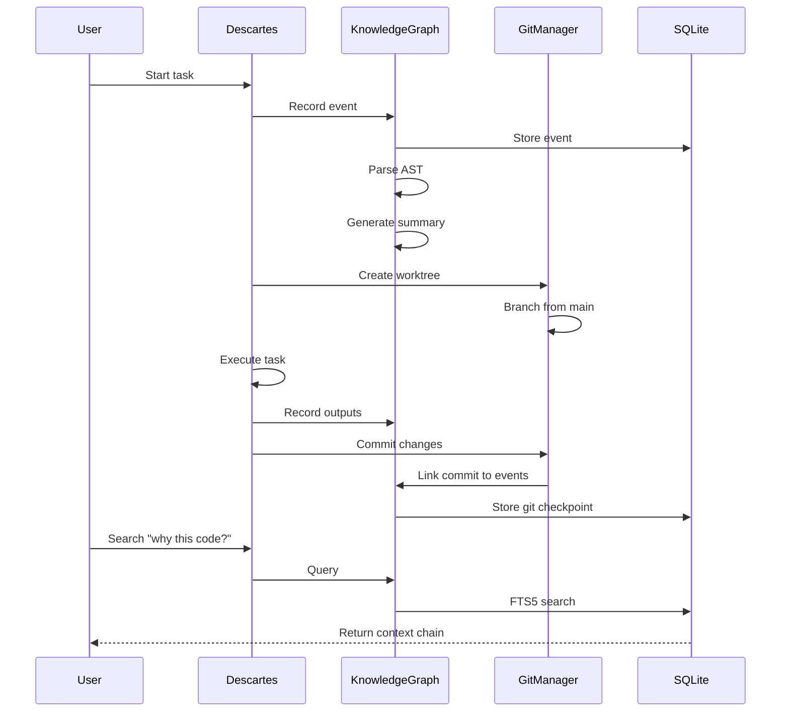

# Product Requirements Document: Descartes Knowledge Graph
## *The Memory and Intelligence Layer*

---

## Version History
| Version | Date | Author | Status | Notes |
|---------|------|--------|--------|-------|
| 1.0 | November 19, 2025 | System Architect | Draft | Knowledge Graph & Git Integration Module |

---

## Table of Contents
1. [Executive Summary](#1-executive-summary)
2. [Problem Statement](#2-problem-statement)
3. [System Architecture](#3-system-architecture)
4. [Data Model](#4-data-model)
5. [Core Features](#5-core-features)
6. [Git Integration Strategy](#6-git-integration-strategy)
7. [Search & Analytics](#7-search--analytics)
8. [Implementation Plan](#8-implementation-plan)
9. [Success Metrics](#9-success-metrics)

---

## 1. Executive Summary

### 1.1 Overview

The Descartes Knowledge Graph is a **persistent, searchable memory system** that captures every decision, conversation, and code change in the AI development process. It transforms Descartes from a stateless orchestrator into an intelligent system that learns from its history and provides deep insights into how code evolved.

### 1.2 Core Value Propositions

1. **Total Recall**: Every AI interaction, decision, and output is preserved and searchable
2. **Time Machine**: Navigate to any point in development history and see the full context
3. **Git Archaeology**: Understand not just what changed, but why the AI made those changes
4. **Learning System**: Extract patterns from successful completions to improve future performance
5. **Parallel Universes**: Isolate experiments in git worktrees while maintaining global awareness

### 1.3 Key Innovation

Unlike traditional development logs that capture only outcomes, the Knowledge Graph captures **causality**—the chain of reasoning that led from requirement to implementation. Every git commit is linked to the AI conversations, plans, and decisions that produced it.

---

## 2. Problem Statement

### 2.1 The Context Loss Problem

Current State:
- AI conversations are ephemeral—closed chat loses all context
- No connection between AI decisions and git commits
- Can't answer "Why did the AI write this code?"
- No way to search across past AI interactions
- Each session starts from zero knowledge

Impact:
- **Wasted Tokens**: Re-explaining context costs $1000s in API fees
- **Lost Knowledge**: Successful patterns aren't captured for reuse
- **Debugging Nightmare**: Can't trace bad code to its AI origin
- **No Accountability**: No audit trail of AI decision-making

### 2.2 The Parallel Development Problem

Current State:
- AI agents work in the same git branch, causing conflicts
- No isolation between experimental and stable code
- Can't run multiple experiments simultaneously
- Difficult to compare different AI approaches

Impact:
- **Merge Conflicts**: Agents overwrite each other's work
- **Broken Builds**: Experimental code breaks main branch
- **Serial Development**: Can't explore multiple solutions in parallel
- **No Comparison**: Can't A/B test different approaches

### 2.3 The Search Problem

Current State:
- Can't search across AI conversations
- No way to find "that solution from last week"
- Code search doesn't include the context of why it was written
- No semantic search across knowledge base

Impact:
- **Repeated Solutions**: Solving the same problem multiple times
- **Lost Insights**: Valuable patterns buried in chat history
- **Slow Debugging**: Can't quickly find relevant past decisions
- **No Learning**: System doesn't get smarter over time

---

## 3. System Architecture

### 3.1 High-Level Architecture

```
┌─────────────────────────────────────────────────┐
│                 Descartes Core                   │
│         (Orchestration, UI, Agents)             │
└─────────────────┬───────────────────────────────┘
                  │
                  ▼
┌─────────────────────────────────────────────────┐
│            Knowledge Graph Layer                 │
├─────────────────────────────────────────────────┤
│                                                 │
│  ┌───────────────┐  ┌───────────────┐         │
│  │   Event       │  │   Search      │         │
│  │   Processor   │  │   Engine      │         │
│  └───────┬───────┘  └───────┬───────┘         │
│          │                  │                   │
│          ▼                  ▼                   │
│  ┌─────────────────────────────────┐          │
│  │     SQLite Database (FTS5)      │          │
│  │                                  │          │
│  │  Events │ Code │ Git │ Search   │          │
│  └─────────────────────────────────┘          │
│          │                                     │
│          ▼                                     │
│  ┌───────────────┐  ┌───────────────┐        │
│  │  AST Parser   │  │  Summarizer   │        │
│  │  (Tree-sitter)│  │  (LLM)        │        │
│  └───────────────┘  └───────────────┘        │
└─────────────────────────────────────────────────┘
                  │
                  ▼
┌─────────────────────────────────────────────────┐
│            Git Integration Layer                 │
├─────────────────────────────────────────────────┤
│                                                 │
│  ┌───────────────┐  ┌───────────────┐         │
│  │   Worktree    │  │     Meta      │         │
│  │   Manager     │  │   Repository  │         │
│  └───────────────┘  └───────────────┘         │
│                                                 │
│  Main Repo │ Feature Worktrees │ Meta Repo    │
└─────────────────────────────────────────────────┘
```

### 3.2 Component Interactions



---

## 4. Data Model

### 4.1 Core Schema

```sql
-- Primary event table: The source of truth
CREATE TABLE events (
    -- Identity
    id INTEGER PRIMARY KEY AUTOINCREMENT,
    uuid TEXT UNIQUE NOT NULL DEFAULT (lower(hex(randomblob(16)))),
    
    -- Classification
    event_type TEXT NOT NULL CHECK(event_type IN (
        'session_start', 'session_end',
        'architect_chat', 'plan_created', 'plan_frozen',
        'task_created', 'task_assigned', 'task_started', 'task_completed',
        'agent_spawned', 'agent_output', 'agent_terminated',
        'approval_requested', 'approval_granted', 'approval_denied',
        'context_loaded', 'context_sliced',
        'code_generated', 'code_modified', 'code_validated',
        'error', 'warning'
    )),
    
    -- Temporal
    timestamp DATETIME NOT NULL DEFAULT CURRENT_TIMESTAMP,
    duration_ms INTEGER,
    
    -- Relationships
    session_id TEXT NOT NULL,
    parent_event_id INTEGER REFERENCES events(id),
    caused_by_event_id INTEGER REFERENCES events(id),
    
    -- Actor (who/what triggered this)
    actor_type TEXT CHECK(actor_type IN ('user', 'agent', 'system')),
    actor_id TEXT,
    
    -- Content
    content_type TEXT CHECK(content_type IN ('text', 'code', 'json', 'markdown', 'diff')),
    content TEXT NOT NULL,
    content_hash TEXT GENERATED ALWAYS AS (hex(sha256(content))) STORED,
    
    -- Metadata
    metadata JSON,
    
    -- Git state
    git_repo TEXT,
    git_branch TEXT,
    git_commit TEXT,
    git_worktree TEXT,
    
    -- Metrics
    tokens_used INTEGER,
    cost_cents INTEGER,
    
    -- Indexing
    INDEX idx_events_session (session_id),
    INDEX idx_events_timestamp (timestamp),
    INDEX idx_events_actor (actor_type, actor_id),
    INDEX idx_events_git (git_commit)
);

-- Full-text search index
CREATE VIRTUAL TABLE events_fts USING fts5(
    event_type,
    actor_id,
    content,
    metadata,
    content=events,
    content_rowid=id,
    tokenize='porter unicode61'
);

-- Trigger to keep FTS in sync
CREATE TRIGGER events_fts_sync AFTER INSERT ON events BEGIN
    INSERT INTO events_fts (rowid, event_type, actor_id, content, metadata)
    VALUES (new.id, new.event_type, new.actor_id, new.content, new.metadata);
END;
```

### 4.2 Code Analysis Schema

```sql
-- Parsed code blocks with AST
CREATE TABLE code_artifacts (
    id INTEGER PRIMARY KEY AUTOINCREMENT,
    event_id INTEGER NOT NULL REFERENCES events(id),
    
    -- Location
    file_path TEXT NOT NULL,
    start_line INTEGER,
    end_line INTEGER,
    
    -- Content
    language TEXT NOT NULL,
    content TEXT NOT NULL,
    
    -- Tree-sitter AST
    ast JSON,
    ast_hash TEXT GENERATED ALWAYS AS (json_extract(ast, '$.hash')) STORED,
    
    -- Extracted symbols
    symbols JSON, -- {functions: [], classes: [], imports: []}
    
    -- Metrics
    complexity_score INTEGER,
    lines_of_code INTEGER,
    comment_ratio REAL,
    
    -- Semantic analysis
    summary TEXT, -- LLM-generated summary
    purpose TEXT, -- What this code does
    dependencies JSON, -- Files/symbols this depends on
    
    INDEX idx_code_filepath (file_path),
    INDEX idx_code_language (language),
    INDEX idx_code_symbols (symbols)
);

-- Code relationships (calls, imports, etc)
CREATE TABLE code_relationships (
    id INTEGER PRIMARY KEY,
    source_artifact_id INTEGER REFERENCES code_artifacts(id),
    target_artifact_id INTEGER REFERENCES code_artifacts(id),
    relationship_type TEXT CHECK(relationship_type IN (
        'imports', 'calls', 'extends', 'implements', 'uses', 'modifies'
    )),
    metadata JSON
);
```

### 4.3 Git Integration Schema

```sql
-- Git commits linked to AI events
CREATE TABLE git_checkpoints (
    id INTEGER PRIMARY KEY AUTOINCREMENT,
    
    -- Git info
    commit_sha TEXT NOT NULL,
    parent_sha TEXT,
    branch TEXT NOT NULL,
    worktree TEXT,
    
    -- Commit metadata
    author TEXT,
    committer TEXT,
    commit_time DATETIME,
    commit_message TEXT,
    
    -- Change summary
    files_changed INTEGER,
    insertions INTEGER,
    deletions INTEGER,
    diff_stats JSON,
    
    -- AI context
    triggering_event_id INTEGER REFERENCES events(id),
    ai_rationale TEXT, -- Why the AI made these changes
    task_completed TEXT,
    validation_status TEXT,
    
    -- Linking
    session_id TEXT,
    
    UNIQUE(commit_sha),
    INDEX idx_git_branch (branch),
    INDEX idx_git_session (session_id)
);

-- Link events to the commits they produced
CREATE TABLE event_git_links (
    event_id INTEGER REFERENCES events(id),
    commit_sha TEXT REFERENCES git_checkpoints(commit_sha),
    link_type TEXT CHECK(link_type IN ('produced', 'modified', 'reviewed')),
    PRIMARY KEY (event_id, commit_sha)
);
```

### 4.4 Learning & Patterns Schema

```sql
-- Successful patterns extracted from history
CREATE TABLE learned_patterns (
    id INTEGER PRIMARY KEY AUTOINCREMENT,
    
    -- Pattern identification
    pattern_hash TEXT UNIQUE NOT NULL,
    pattern_type TEXT CHECK(pattern_type IN (
        'task_approach', 'error_fix', 'refactoring', 'architecture'
    )),
    
    -- Pattern content
    description TEXT,
    preconditions JSON,
    approach JSON,
    expected_outcome JSON,
    
    -- Statistics
    success_count INTEGER DEFAULT 0,
    failure_count INTEGER DEFAULT 0,
    success_rate REAL GENERATED ALWAYS AS (
        CAST(success_count AS REAL) / (success_count + failure_count)
    ) STORED,
    
    -- Usage
    last_used DATETIME,
    created_from_events JSON, -- Event IDs that formed this pattern
    
    INDEX idx_patterns_type (pattern_type),
    INDEX idx_patterns_success (success_rate DESC)
);

-- Semantic embeddings for similarity search
CREATE TABLE embeddings (
    id INTEGER PRIMARY KEY,
    event_id INTEGER UNIQUE REFERENCES events(id),
    
    -- Embedding data
    model TEXT NOT NULL,
    embedding BLOB NOT NULL, -- Stored as binary array
    dimension INTEGER NOT NULL,
    
    -- Metadata
    created_at DATETIME DEFAULT CURRENT_TIMESTAMP,
    
    INDEX idx_embeddings_model (model)
);
```

---

## 5. Core Features

### 5.1 Event Processing Pipeline

```rust
pub struct EventProcessor {
    db: Arc<SqlitePool>,
    ast_parser: AstParser,
    summarizer: LlmSummarizer,
    embedder: Embedder,
}

impl EventProcessor {
    pub async fn process_event(&self, raw_event: RawEvent) -> Result<EventId> {
        // 1. Classify and structure the event
        let event_type = self.classify_event(&raw_event);
        let structured_content = self.structure_content(&raw_event).await?;
        
        // 2. Capture git state
        let git_state = GitState::capture()?;
        
        // 3. Begin transaction
        let mut tx = self.db.begin().await?;
        
        // 4. Insert main event
        let event_id = sqlx::query_scalar!(
            r#"
            INSERT INTO events (
                event_type, session_id, actor_type, actor_id,
                content_type, content, metadata,
                git_repo, git_branch, git_commit, git_worktree,
                tokens_used, cost_cents
            ) VALUES (?, ?, ?, ?, ?, ?, ?, ?, ?, ?, ?, ?, ?)
            RETURNING id
            "#,
            event_type,
            raw_event.session_id,
            raw_event.actor_type,
            raw_event.actor_id,
            structured_content.content_type,
            structured_content.content,
            structured_content.metadata,
            git_state.repo,
            git_state.branch,
            git_state.commit,
            git_state.worktree,
            raw_event.tokens_used,
            raw_event.cost_cents
        )
        .fetch_one(&mut tx)
        .await?;
        
        // 5. Process code artifacts if present
        if let Some(code_blocks) = self.extract_code_blocks(&structured_content) {
            for block in code_blocks {
                self.process_code_artifact(event_id, block, &mut tx).await?;
            }
        }
        
        // 6. Generate embeddings asynchronously
        tokio::spawn({
            let embedder = self.embedder.clone();
            let db = self.db.clone();
            let content = structured_content.content.clone();
            async move {
                if let Ok(embedding) = embedder.embed(&content).await {
                    let _ = Self::store_embedding(db, event_id, embedding).await;
                }
            }
        });
        
        // 7. Commit transaction
        tx.commit().await?;
        
        // 8. Trigger pattern learning if task completed
        if event_type == "task_completed" {
            self.extract_patterns(event_id).await?;
        }
        
        Ok(EventId(event_id))
    }
    
    async fn process_code_artifact(
        &self,
        event_id: i64,
        block: CodeBlock,
        tx: &mut Transaction<'_, Sqlite>
    ) -> Result<()> {
        // Parse AST with tree-sitter
        let ast = self.ast_parser.parse(&block.content, &block.language)?;
        
        // Extract symbols
        let symbols = self.extract_symbols(&ast);
        
        // Calculate metrics
        let metrics = CodeMetrics::calculate(&ast, &block.content);
        
        // Generate AI summary (non-blocking)
        let summary = if block.content.len() > 500 {
            Some(self.summarizer.summarize_code(&block.content).await?)
        } else {
            None
        };
        
        sqlx::query!(
            r#"
            INSERT INTO code_artifacts (
                event_id, file_path, start_line, end_line,
                language, content, ast, symbols,
                complexity_score, lines_of_code, comment_ratio,
                summary, purpose
            ) VALUES (?, ?, ?, ?, ?, ?, ?, ?, ?, ?, ?, ?, ?)
            "#,
            event_id,
            block.file_path,
            block.start_line,
            block.end_line,
            block.language,
            block.content,
            serde_json::to_string(&ast)?,
            serde_json::to_string(&symbols)?,
            metrics.complexity,
            metrics.loc,
            metrics.comment_ratio,
            summary,
            block.purpose
        )
        .execute(tx)
        .await?;
        
        Ok(())
    }
}
```

### 5.2 Time Machine Navigation

```rust
pub struct TimeMachine {
    knowledge: Arc<KnowledgeGraph>,
    git: Arc<GitManager>,
}

impl TimeMachine {
    pub async fn travel_to(&self, timestamp: DateTime<Utc>) -> Result<PointInTime> {
        // 1. Find all events up to this time
        let events = sqlx::query_as!(
            Event,
            "SELECT * FROM events WHERE timestamp <= ? ORDER BY timestamp",
            timestamp
        )
        .fetch_all(&self.knowledge.db)
        .await?;
        
        // 2. Find git state at this time
        let git_state = sqlx::query!(
            "SELECT commit_sha, branch FROM git_checkpoints 
             WHERE commit_time <= ? 
             ORDER BY commit_time DESC LIMIT 1",
            timestamp
        )
        .fetch_optional(&self.knowledge.db)
        .await?;
        
        // 3. Reconstruct context
        let context = self.reconstruct_context(&events).await?;
        
        // 4. Find active agents at this time
        let active_agents = self.find_active_agents(&events, timestamp).await?;
        
        Ok(PointInTime {
            timestamp,
            events,
            git_state,
            context,
            active_agents,
            statistics: self.calculate_statistics(&events),
        })
    }
    
    pub async fn explain_change(&self, file: &Path, line: usize) -> Result<ChangeExplanation> {
        // Use git blame to find commit
        let commit = self.git.blame(file, line).await?;
        
        // Find events that led to this commit
        let events = sqlx::query_as!(
            Event,
            r#"
            SELECT e.* FROM events e
            JOIN event_git_links egl ON e.id = egl.event_id
            WHERE egl.commit_sha = ?
            ORDER BY e.timestamp
            "#,
            commit.sha
        )
        .fetch_all(&self.knowledge.db)
        .await?;
        
        // Build narrative
        let narrative = self.build_narrative(&events).await?;
        
        Ok(ChangeExplanation {
            file: file.to_path_buf(),
            line,
            commit,
            events,
            narrative,
            ai_rationale: self.get_ai_rationale(&commit.sha).await?,
        })
    }
}
```

---

## 6. Git Integration Strategy

### 6.1 Worktree Architecture

```
project/                          # Main repository
├── .git/                        # Git directory
├── main/                        # Main worktree (stable code)
├── .descartes/                  # Meta repository
│   ├── .git/                   # Descartes git history
│   ├── knowledge.db            # SQLite knowledge graph
│   ├── orchestration.yaml      # Current state
│   └── swarms/                 # Active swarm configurations
│       ├── auth-feature.yaml
│       └── payment-feature.yaml
├── feature-auth/               # Worktree for auth swarm
├── feature-payment/            # Worktree for payment swarm
└── experiment-ai-search/       # Experimental worktree
```

### 6.2 Worktree Manager

```rust
pub struct WorktreeManager {
    main_repo: Repository,
    meta_repo: Repository,
    worktrees: DashMap<String, Worktree>,
    knowledge: Arc<KnowledgeGraph>,
}

impl WorktreeManager {
    pub async fn create_swarm_worktree(&self, swarm_id: &str, base_branch: &str) -> Result<Worktree> {
        // 1. Create worktree
        let worktree_name = format!("swarm-{}", swarm_id);
        let branch_name = format!("ai/{}", swarm_id);
        
        let worktree = self.main_repo.worktree_add(
            Path::new(&worktree_name),
            Some(&branch_name),
            &WorktreeAddOptions::new()
                .reference(base_branch)
        )?;
        
        // 2. Record in meta repository
        let swarm_config = SwarmConfig {
            id: swarm_id.to_string(),
            worktree: worktree_name.clone(),
            branch: branch_name.clone(),
            base_branch: base_branch.to_string(),
            created_at: Utc::now(),
        };
        
        self.meta_repo.add_file(
            &format!("swarms/{}.yaml", swarm_id),
            &serde_yaml::to_string(&swarm_config)?
        )?;
        
        self.meta_repo.commit(&format!("Created swarm: {}", swarm_id))?;
        
        // 3. Record in knowledge graph
        self.knowledge.record_event(RawEvent {
            event_type: "swarm_worktree_created",
            content: serde_json::to_string(&swarm_config)?,
            ..Default::default()
        }).await?;
        
        // 4. Store and return
        self.worktrees.insert(swarm_id.to_string(), worktree.clone());
        Ok(worktree)
    }
    
    pub async fn checkpoint_all(&self, message: &str) -> Result<()> {
        // 1. Checkpoint each worktree
        for entry in self.worktrees.iter() {
            let (swarm_id, worktree) = entry.pair();
            
            if worktree.has_changes()? {
                // Commit changes
                let commit = worktree.commit_all(message)?;
                
                // Record checkpoint
                self.record_checkpoint(swarm_id, &commit).await?;
            }
        }
        
        // 2. Update meta repository
        self.meta_repo.add_file(
            "state/checkpoint.yaml",
            &serde_yaml::to_string(&self.get_global_state()?)?
        )?;
        
        self.meta_repo.commit(&format!("Checkpoint: {}", message))?;
        
        // 3. Backup knowledge graph
        self.knowledge.backup().await?;
        
        Ok(())
    }
    
    async fn record_checkpoint(&self, swarm_id: &str, commit: &Commit) -> Result<()> {
        // Get AI rationale for these changes
        let rationale = self.generate_rationale(swarm_id, commit).await?;
        
        sqlx::query!(
            r#"
            INSERT INTO git_checkpoints (
                commit_sha, parent_sha, branch, worktree,
                author, commit_time, commit_message,
                files_changed, insertions, deletions,
                ai_rationale, session_id
            ) VALUES (?, ?, ?, ?, ?, ?, ?, ?, ?, ?, ?, ?)
            "#,
            commit.id().to_string(),
            commit.parent_id(0)?.to_string(),
            commit.branch,
            swarm_id,
            "Descartes AI",
            commit.time(),
            commit.message(),
            commit.stats.files_changed,
            commit.stats.insertions,
            commit.stats.deletions,
            rationale,
            swarm_id
        )
        .execute(&self.knowledge.db)
        .await?;
        
        Ok(())
    }
}
```

### 6.3 Meta Repository

The `.descartes/` directory is itself a git repository that tracks:

```yaml
# .descartes/orchestration.yaml
version: 1.0
project:
  name: "E-Commerce Platform"
  created: "2025-11-19T10:00:00Z"
  main_branch: "main"

active_swarms:
  - id: "auth-feature"
    worktree: "feature-auth"
    branch: "ai/auth-feature"
    status: "in_progress"
    agents:
      - id: "agent-001"
        type: "architect"
        model: "claude-opus"
        status: "completed"
      - id: "agent-002"
        type: "implementer"
        model: "deepseek-coder"
        status: "running"
    progress: 0.65
    
  - id: "payment-feature"
    worktree: "feature-payment"
    branch: "ai/payment-feature"
    status: "pending_review"
    progress: 0.90

completed_swarms:
  - id: "database-schema"
    merged_commit: "abc123"
    completion_date: "2025-11-18T15:30:00Z"
    metrics:
      tokens_used: 45000
      cost_usd: 4.50
      time_hours: 2.5
      lines_of_code: 1200
```

---

## 7. Search & Analytics

### 7.1 Multi-Modal Search

```rust
pub struct SearchEngine {
    db: Arc<SqlitePool>,
    embedder: Embedder,
}

impl SearchEngine {
    pub async fn search(&self, query: Query) -> Result<SearchResults> {
        match query {
            Query::FullText(text) => self.fts_search(text).await,
            Query::Semantic(text) => self.semantic_search(text).await,
            Query::Code(pattern) => self.code_search(pattern).await,
            Query::Time(range) => self.time_search(range).await,
            Query::Git(commit_or_file) => self.git_search(commit_or_file).await,
            Query::Combined(queries) => self.combined_search(queries).await,
        }
    }
    
    async fn fts_search(&self, text: &str) -> Result<SearchResults> {
        let results = sqlx::query_as!(
            SearchResult,
            r#"
            SELECT 
                e.*,
                snippet(events_fts, -1, '<mark>', '</mark>', '...', 32) as snippet,
                rank
            FROM events e
            JOIN events_fts ON e.id = events_fts.rowid
            WHERE events_fts MATCH ?
            ORDER BY rank
            LIMIT 50
            "#,
            text
        )
        .fetch_all(&self.db)
        .await?;
        
        Ok(SearchResults { results, query: text.to_string() })
    }
    
    async fn semantic_search(&self, text: &str) -> Result<SearchResults> {
        // Generate embedding for query
        let query_embedding = self.embedder.embed(text).await?;
        
        // Find similar events using vector similarity
        let results = sqlx::query_as!(
            SearchResult,
            r#"
            SELECT 
                e.*,
                vector_distance(em.embedding, ?) as distance
            FROM events e
            JOIN embeddings em ON e.id = em.event_id
            WHERE distance < 0.5
            ORDER BY distance
            LIMIT 50
            "#,
            query_embedding
        )
        .fetch_all(&self.db)
        .await?;
        
        Ok(SearchResults { results, query: text.to_string() })
    }
    
    async fn code_search(&self, pattern: &CodePattern) -> Result<SearchResults> {
        let ast_query = pattern.to_ast_query();
        
        let results = sqlx::query_as!(
            SearchResult,
            r#"
            SELECT DISTINCT e.*
            FROM events e
            JOIN code_artifacts ca ON e.id = ca.event_id
            WHERE json_extract(ca.ast, ?) IS NOT NULL
            OR json_extract(ca.symbols, ?) LIKE ?
            "#,
            ast_query.path,
            ast_query.symbol_path,
            pattern.symbol_pattern
        )
        .fetch_all(&self.db)
        .await?;
        
        Ok(SearchResults { results, query: pattern.to_string() })
    }
}
```

### 7.2 Pattern Learning

```rust
pub struct PatternLearner {
    knowledge: Arc<KnowledgeGraph>,
}

impl PatternLearner {
    pub async fn learn_from_success(&self, task_id: &str) -> Result<Pattern> {
        // 1. Get all events for successful task
        let events = self.get_task_events(task_id).await?;
        
        // 2. Extract approach
        let approach = self.extract_approach(&events)?;
        
        // 3. Find similar past tasks
        let similar_tasks = self.find_similar_tasks(task_id).await?;
        
        // 4. Identify common patterns
        let pattern = Pattern {
            id: Uuid::new_v4(),
            pattern_type: "task_approach",
            description: self.describe_pattern(&approach).await?,
            preconditions: self.extract_preconditions(&events),
            approach: approach.clone(),
            expected_outcome: self.extract_outcome(&events),
            confidence: self.calculate_confidence(&similar_tasks),
        };
        
        // 5. Store pattern
        sqlx::query!(
            r#"
            INSERT INTO learned_patterns (
                pattern_hash, pattern_type, description,
                preconditions, approach, expected_outcome,
                success_count, created_from_events
            ) VALUES (?, ?, ?, ?, ?, ?, ?, ?)
            "#,
            pattern.hash(),
            pattern.pattern_type,
            pattern.description,
            json!(pattern.preconditions),
            json!(pattern.approach),
            json!(pattern.expected_outcome),
            1,
            json!(events.iter().map(|e| e.id).collect::<Vec<_>>())
        )
        .execute(&self.knowledge.db)
        .await?;
        
        Ok(pattern)
    }
    
    pub async fn suggest_approach(&self, task: &Task) -> Result<Vec<Suggestion>> {
        // 1. Find similar patterns
        let patterns = sqlx::query_as!(
            Pattern,
            r#"
            SELECT * FROM learned_patterns
            WHERE pattern_type = 'task_approach'
            AND success_rate > 0.7
            ORDER BY success_rate DESC, success_count DESC
            LIMIT 10
            "#
        )
        .fetch_all(&self.knowledge.db)
        .await?;
        
        // 2. Score relevance to current task
        let mut suggestions = Vec::new();
        for pattern in patterns {
            let relevance = self.calculate_relevance(&pattern, task).await?;
            if relevance > 0.5 {
                suggestions.push(Suggestion {
                    pattern,
                    relevance,
                    rationale: self.explain_relevance(relevance).await?,
                });
            }
        }
        
        Ok(suggestions)
    }
}
```

### 7.3 Analytics Dashboard

```rust
pub struct Analytics {
    knowledge: Arc<KnowledgeGraph>,
}

impl Analytics {
    pub async fn project_metrics(&self, project_id: &str) -> Result<ProjectMetrics> {
        Ok(ProjectMetrics {
            total_events: self.count_events(project_id).await?,
            total_tokens: self.sum_tokens(project_id).await?,
            total_cost: self.sum_cost(project_id).await?,
            active_swarms: self.count_active_swarms(project_id).await?,
            completion_rate: self.calculate_completion_rate(project_id).await?,
            average_task_time: self.average_task_duration(project_id).await?,
            pattern_reuse_rate: self.pattern_reuse_rate(project_id).await?,
            git_stats: self.git_statistics(project_id).await?,
        })
    }
    
    pub async fn agent_performance(&self, time_range: DateRange) -> Result<AgentMetrics> {
        sqlx::query_as!(
            AgentMetrics,
            r#"
            SELECT 
                actor_id as agent_id,
                COUNT(*) as total_tasks,
                AVG(duration_ms) as avg_duration_ms,
                SUM(tokens_used) as total_tokens,
                SUM(cost_cents) as total_cost_cents,
                COUNT(CASE WHEN event_type = 'task_completed' THEN 1 END) as completed_tasks,
                COUNT(CASE WHEN event_type = 'error' THEN 1 END) as errors
            FROM events
            WHERE actor_type = 'agent'
            AND timestamp BETWEEN ? AND ?
            GROUP BY actor_id
            "#,
            time_range.start,
            time_range.end
        )
        .fetch_all(&self.knowledge.db)
        .await
    }
}
```

---

## 8. Implementation Plan

### Phase 1: Foundation (Week 1-2)
- [ ] Design and create SQLite schema
- [ ] Implement basic event recording
- [ ] Set up FTS5 indexing
- [ ] Create event processor pipeline
- [ ] Add git state capture

**Deliverables**: 
- Working SQLite database with FTS5
- Basic event recording from Descartes core
- Git commit linking

### Phase 2: Code Intelligence (Week 3-4)
- [ ] Integrate tree-sitter for Rust, Python, TypeScript, JavaScript
- [ ] Implement AST parsing and storage
- [ ] Add symbol extraction
- [ ] Create code complexity metrics
- [ ] Build code relationship graph

**Deliverables**:
- AST parsing for generated code
- Searchable symbol index
- Code complexity tracking

### Phase 3: Git Integration (Week 5-6)
- [ ] Implement worktree manager
- [ ] Create meta repository structure
- [ ] Add checkpoint system
- [ ] Build commit-to-event linking
- [ ] Implement git archaeology features

**Deliverables**:
- Parallel development in worktrees
- Meta repository tracking
- Git blame to AI context

### Phase 4: Search Engine (Week 7-8)
- [ ] Implement FTS5 search
- [ ] Add semantic search with embeddings
- [ ] Create AST-based code search
- [ ] Build time-based search
- [ ] Implement combined search

**Deliverables**:
- Multi-modal search interface
- Sub-second search performance
- Search UI in Descartes

### Phase 5: Intelligence Layer (Week 9-10)
- [ ] Implement pattern extraction
- [ ] Build pattern matching
- [ ] Create suggestion engine
- [ ] Add success prediction
- [ ] Implement learning feedback loop

**Deliverables**:
- Pattern learning from successful tasks
- Approach suggestions for new tasks
- Continuous improvement metrics

### Phase 6: Analytics & Visualization (Week 11-12)
- [ ] Create metrics aggregation
- [ ] Build time machine interface
- [ ] Add project dashboards
- [ ] Implement cost tracking
- [ ] Create performance reports

**Deliverables**:
- Analytics dashboard in UI
- Time machine navigation
- Detailed cost and performance metrics

---

## 9. Success Metrics

### 9.1 Performance Metrics

| Metric | Target | Measurement |
|--------|--------|-------------|
| Event Ingestion Rate | > 1000 events/second | Benchmark test |
| Search Latency (FTS) | < 100ms for 1M events | 95th percentile |
| Search Latency (Semantic) | < 500ms for 100K embeddings | 95th percentile |
| AST Parse Time | < 50ms per file | Average for 1000 files |
| Storage Efficiency | < 10x raw content size | Compressed size ratio |
| Pattern Learning Time | < 1 second per task | Average learning time |

### 9.2 Usage Metrics

| Metric | Target (3 months) | Target (6 months) |
|--------|-------------------|-------------------|
| Events Recorded | 1M | 10M |
| Searches Performed | 10K | 100K |
| Patterns Learned | 100 | 1000 |
| Pattern Reuse Rate | 30% | 60% |
| Context Recovery Rate | 90% | 95% |
| Successful Worktree Merges | 80% | 90% |

### 9.3 Value Metrics

| Metric | Target | Measurement |
|--------|--------|-------------|
| Token Savings | 50% reduction | Compare with/without history |
| Debug Time | 70% reduction | Time to find issue cause |
| Pattern Success Rate | > 80% | Successful pattern applications |
| Knowledge Retention | 100% | No lost conversations |
| Parallel Development | 5x throughput | Tasks completed per hour |

---

## Appendix A: Query Examples

### A.1 Full-Text Search
```sql
-- Find all mentions of "authentication"
SELECT * FROM events_fts 
WHERE events_fts MATCH 'authentication'
ORDER BY rank;

-- Find events with multiple terms
SELECT * FROM events_fts 
WHERE events_fts MATCH 'database AND migration'
ORDER BY rank;
```

### A.2 Code Pattern Search
```sql
-- Find all functions that call "authenticate"
SELECT DISTINCT e.* 
FROM events e
JOIN code_artifacts ca ON e.id = ca.event_id
WHERE json_extract(ca.ast, '$.calls[*].name') LIKE '%authenticate%';

-- Find all async functions
SELECT * FROM code_artifacts
WHERE json_extract(ast, '$.async') = true;
```

### A.3 Time-Based Search
```sql
-- Find what led to a specific commit
SELECT e.* FROM events e
JOIN event_git_links egl ON e.id = egl.event_id
WHERE egl.commit_sha = 'abc123def456'
ORDER BY e.timestamp;

-- Find all events in a time range
SELECT * FROM events
WHERE timestamp BETWEEN '2025-11-01' AND '2025-11-19'
AND session_id = 'session-123';
```

### A.4 Learning Queries
```sql
-- Find most successful patterns
SELECT * FROM learned_patterns
WHERE success_rate > 0.8
ORDER BY success_count DESC
LIMIT 10;

-- Find patterns for similar tasks
SELECT lp.* FROM learned_patterns lp
WHERE EXISTS (
    SELECT 1 FROM json_each(lp.preconditions)
    WHERE value LIKE '%API endpoint%'
);
```

---

## Appendix B: Migration Strategy

For existing Descartes installations, migration to the Knowledge Graph system:

### Step 1: Create Schema
```bash
# Run migrations
descartes migrate --to knowledge-graph
```

### Step 2: Import History
```bash
# Import existing sessions
descartes import --from-sessions ./sessions/

# Import git history
descartes import --from-git ./
```

### Step 3: Build Indices
```bash
# Build FTS index
descartes index --type fts

# Generate embeddings
descartes index --type embeddings --model text-embedding-3-small

# Parse AST for existing code
descartes index --type ast --languages rust,python,typescript
```

### Step 4: Learn Patterns
```bash
# Extract patterns from successful tasks
descartes learn --from-successful-tasks

# Validate patterns
descartes validate-patterns --confidence-threshold 0.7
```

---

## Conclusion

The Descartes Knowledge Graph transforms AI development from a series of disconnected conversations into a continuous learning system. By capturing not just what was built but why and how it was built, we create a development environment that gets smarter over time.

The integration with git worktrees enables true parallel development, while the meta-repository provides a higher-level view of the entire orchestration. The combination of FTS5, semantic search, and AST analysis makes all knowledge instantly accessible.

This isn't just logging—it's building a brain for your development process.

**Key Outcomes**:
- Never lose context or decisions
- Understand why every line of code exists
- Learn from successes and failures
- Search across all dimensions of development
- True parallel, isolated development
- AI that gets smarter with use
