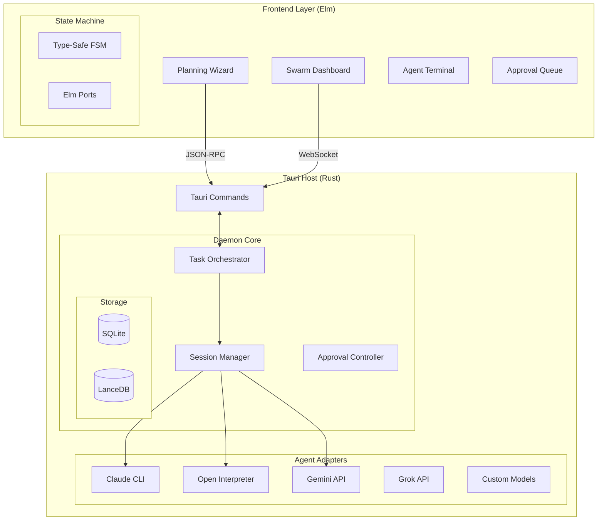

# Product Requirements Document: Descartes
## *The Rigorous Human-in-the-Loop AI Orchestration IDE*

---

## Version History
| Version | Date | Author | Status | Notes |
|---------|------|--------|--------|-------|
| 1.0 | November 19, 2025 | Unified from multiple sources | Draft | Combined best practices from TaskMaster PRDs and Descartes draft |

---

## Executive Summary

**Descartes** is a next-generation Human-in-the-Loop IDE that orchestrates multiple AI agents to execute complex software development workflows. Unlike traditional AI coding assistants that operate as single-threaded chat interfaces, Descartes implements a rigorous **"Architect → Plan → Swarm"** workflow with multi-agent orchestration, session persistence, and comprehensive approval controls.

The system serves as **"Tmux for AI Agents"**—allowing developers to spawn, manage, attach to, and detach from persistent agent sessions while maintaining strict human oversight over dangerous operations. Descartes transforms AI development from ad-hoc conversations into structured, repeatable, and auditable engineering workflows.

### Key Differentiators

1. **Rigor-First Workflow**: Enforces structured PRD creation and task decomposition before any code generation
2. **Headless Architecture**: Rust daemon manages agent lifecycles independent of UI—true session persistence
3. **Model Agnostic**: Native support for Claude, OpenCode, Gemini, Grok, and custom models via unified trait system
4. **Type-Safe UI**: Elm's compile-time guarantees prevent invalid UI states in complex workflows
5. **Swarm Orchestration**: Parallel execution across specialized agents with dependency management

---

## 1. Problem Statement

### 1.1 Current State Limitations

Modern AI development tools suffer from critical architectural and workflow limitations:

#### Single-Agent Bottleneck
Current tools (Claude Code, Cursor, Windsurf, GitHub Copilot) operate with a single AI model, creating performance bottlenecks and preventing specialization. Complex projects require different capabilities—high reasoning for architecture, speed for boilerplate, specialized knowledge for domains.

#### Lack of Planning Rigor
AI assistants jump directly from requirements to implementation without formal planning, task decomposition, or approval gates. This leads to:
- Architectural drift and technical debt
- Inconsistent implementation patterns
- Difficulty in reviewing and understanding AI-generated code

#### Session Volatility
- Closing a terminal or browser tab loses all context
- No way to resume work or hand off sessions between team members
- Long-running tasks fail without recovery mechanisms

#### Unsafe Execution
AI agents can execute destructive commands without human oversight:
- Unintended file deletions or overwrites
- Execution of malicious code
- API calls with production credentials

#### Model Lock-in
Tools are tightly coupled to specific AI providers, preventing users from:
- Leveraging the best model for each task type
- Optimizing for cost vs. performance
- Using local models for sensitive data

### 1.2 User Pain Points

- **Context Loss**: Engineers waste 30-40% of time re-explaining context when sessions terminate
- **Isolation**: Teams cannot collaborate on AI-assisted development—each developer works alone
- **Capability Mismatch**: Forced to use one model for all tasks despite varying requirements
- **Audit Blindness**: No visibility into AI decision-making or action history
- **Quality Drift**: No systematic enforcement of architectural decisions or coding standards

---

## 2. Vision & Objectives

### 2.1 Product Vision

Descartes reimagines AI-assisted development as a **factory floor rather than a conversation**. Projects flow through structured phases—planning, decomposition, assignment, execution, and review—with appropriate AI models and human oversight at each stage.

We treat AI agents not as assistants, but as a supervised workforce that requires:
- Clear specifications before starting work
- Appropriate tools and permissions for their tasks
- Continuous monitoring and quality control
- Human approval for critical decisions

### 2.2 Core Objectives

1. **Enable parallel execution** of development tasks across specialized AI agents
2. **Enforce rigorous planning** and approval workflows before code generation
3. **Provide persistent sessions** that survive UI disconnections and support handoffs
4. **Implement granular controls** for all potentially dangerous operations
5. **Support heterogeneous models** within a single project for optimal task matching
6. **Create comprehensive audit trails** for compliance and debugging

### 2.3 Success Metrics

- **Adoption**: 100+ daily active developers within 6 months
- **Productivity**: 3x faster feature development vs single-agent tools
- **Quality**: 90% of generated code passing initial review
- **Safety**: <1% of approved operations causing issues
- **Reliability**: 99.9% uptime for daemon processes

---

## 3. Technical Architecture

### 3.1 Core Principles

#### The "Bilingual" Stack
We reject polyglot complexity (Go + TypeScript + Rust + Python) in favor of:
- **Backend**: Rust for performance, safety, and existing CLI integration
- **Frontend**: Elm for type-safe state management and "no runtime exceptions" guarantee
- **Bridge**: Tauri v2 for native desktop integration

#### The "Interceptor" Pattern
Descartes operates as a man-in-the-middle between AI agents and the OS:
- Agents run in sandboxed environments or PTYs controlled by Rust
- Dangerous system calls are intercepted and queued
- Execution pauses for explicit user approval

#### The "Context Slice" Strategy
Instead of dumping entire repositories into context windows:
- Each task receives only relevant context
- Frontend tasks see frontend code and design docs
- Backend tasks see APIs and data models
- Reduces token usage and improves focus

### 3.2 System Components



### 3.3 Data Models

#### Core Entities

```rust
// Rust Backend Models
pub struct Project {
    pub id: Uuid,
    pub name: String,
    pub prd: PrdDocument,
    pub architecture: Architecture,
    pub task_graph: DAG<Task>,
    pub status: ProjectStatus,
}

pub struct Session {
    pub id: Uuid,
    pub project_id: Uuid,
    pub agent_type: AgentType,
    pub task_id: Uuid,
    pub process: AgentProcess,
    pub status: SessionStatus,
    pub history: RingBuffer<Event>,
    pub approval_queue: Vec<ApprovalRequest>,
}

pub struct ApprovalRequest {
    pub id: Uuid,
    pub session_id: Uuid,
    pub operation: Operation,
    pub risk_level: RiskLevel,
    pub context: serde_json::Value,
    pub status: ApprovalStatus,
}
```

```elm
-- Elm Frontend Models
type alias Project =
    { id : String
    , name : String
    , prd : PrdDocument
    , phases : List Phase
    , status : ProjectStatus
    }

type PlanningState
    = DraftingPRD PrdData
    | ReviewingArchitecture Architecture
    | DecomposingTasks TaskGraph
    | ApprovingPlan Project
    | Executing ExecutionState

type alias Task =
    { id : String
    , description : String
    , assignedAgent : AgentType
    , dependencies : List TaskId
    , status : TaskStatus
    , context : ContextSlice
    }
```

### 3.4 Agent Adapter Trait

```rust
#[async_trait]
pub trait AgentAdapter {
    // Initialize agent with configuration
    async fn initialize(&mut self, config: AgentConfig) -> Result<()>;
    
    // Send prompt and receive streaming response
    fn send_prompt(&mut self, prompt: String) -> BoxStream<AgentEvent>;
    
    // Intercept tool calls for approval
    async fn on_tool_use(&mut self, tool: ToolCall) -> ApprovalRequest;
    
    // Execute approved action
    async fn execute_approved(&mut self, approval: ApprovalResponse) -> Result<ToolResult>;
    
    // Clean shutdown
    async fn shutdown(&mut self) -> Result<()>;
}
```

---

## 4. Features & Requirements

### 4.1 Planning Phase - "The Architect"

#### PRD Creation Wizard [MUST HAVE]
- **Guided workflow** with templates for common project types
- **AI-assisted drafting** using high-reasoning models (Gemini 1.5 Pro, Claude Opus)
- **Real-time validation** of requirements completeness
- **Version control** for PRD iterations

#### Task Decomposition [MUST HAVE]
- **Automatic generation** of task DAG from PRD
- **Dependency detection** and critical path analysis
- **Effort estimation** per task
- **Agent recommendation** based on task type

#### Visual Plan Editor [MUST HAVE]
- **Interactive DAG visualization** with drag-and-drop
- **Task modification** without breaking dependencies
- **Resource allocation** view showing agent assignments
- **Approval gate** before execution begins

### 4.2 Execution Phase - "The Swarm"

#### Multi-Agent Orchestration [MUST HAVE]
- **Parallel execution** of independent tasks
- **Dependency management** with automatic sequencing
- **Load balancing** across available agents
- **Failure recovery** with automatic retry or escalation

#### Session Management [MUST HAVE]
- **Persistent sessions** surviving UI disconnection
- **Attach/detach** capability for any running session
- **Session transfer** between team members
- **Background execution** with progress notifications

#### Context Management [SHOULD HAVE]
- **Context slicing** per task for focused execution
- **Vector search** for relevant documentation (LanceDB)
- **Incremental context** building as tasks complete
- **Cross-task communication** through shared memory

### 4.3 Human-in-the-Loop Controls

#### Approval System [MUST HAVE]
- **Operation interception** for file/command/API operations
- **Risk assessment** with automatic categorization
- **Batch approvals** for similar operations
- **Approval templates** for common patterns
- **Emergency stop** to halt all agents instantly

#### Audit & Compliance [MUST HAVE]
- **Complete operation log** with user, timestamp, context
- **Approval history** with decision rationale
- **Change tracking** for all generated code
- **Export capabilities** for compliance reporting

### 4.4 User Interface

#### Planning View [MUST HAVE]
- Wizard interface for PRD creation
- Split-pane with chat and live PRD preview
- Task graph visualization and editor
- Approval workflow before execution

#### Swarm Dashboard [MUST HAVE]
- Grid view of all active agents
- Real-time status and resource usage
- Quick actions (pause, restart, attach)
- Aggregate progress metrics

#### Agent Terminal [MUST HAVE]
- Full terminal emulator (xterm.js)
- Syntax highlighting and inline diffs
- Collapsible thinking blocks
- Approval modals for intercepted operations

#### Approval Queue [SHOULD HAVE]
- Centralized pending approvals across all agents
- Risk-based prioritization
- Bulk actions for similar requests
- Context viewer with code diffs

---

## 5. Implementation Roadmap

### Phase 1: Foundation (Weeks 1-2)
**Goal**: Establish core infrastructure

- Set up Tauri + Elm + Rust development environment
- Implement basic PTY wrapper for subprocess management
- Create minimal Elm UI with terminal component
- Establish Elm-Rust communication via Tauri

**Deliverable**: Terminal in Elm that can run bash commands via Rust

### Phase 2: Claude Integration (Weeks 3-4)
**Goal**: Wrap Claude CLI with interception

- Implement Claude CLI adapter with output parsing
- Detect thinking blocks vs tool calls vs responses
- Create basic approval flow UI
- Add session persistence to SQLite

**Deliverable**: Interactive Claude session with approval controls

### Phase 3: Planning Engine (Weeks 5-6)
**Goal**: Implement rigorous planning workflow

- Build PRD wizard in Elm with FSM
- Integrate AI for task decomposition
- Create DAG visualization and editor
- Implement plan approval gate

**Deliverable**: Complete planning phase with task generation

### Phase 4: Multi-Agent Support (Weeks 7-9)
**Goal**: Enable swarm orchestration

- Add OpenCode and Gemini adapters
- Implement parallel task execution
- Build swarm dashboard UI
- Add dependency management

**Deliverable**: Multiple agents working on independent tasks

### Phase 5: Production Hardening (Weeks 10-12)
**Goal**: Production-ready system

- Implement comprehensive audit logging
- Add security sandboxing for agents
- Build Git/IDE integrations
- Performance optimization and testing
- Documentation and deployment scripts

**Deliverable**: Beta release for early adopters

### Phase 6: Advanced Features (Months 4-6)
- Team collaboration features
- Cloud sync and backup
- Advanced swarm patterns
- Custom agent development SDK
- Enterprise compliance features

---

## 6. Risk Assessment & Mitigations

| Risk | Impact | Probability | Mitigation Strategy |
|------|--------|-------------|-------------------|
| **Elm/Tauri Integration Complexity** | High | Medium | Build proof-of-concept early; use TypeScript interop layer; maintain simple port interface |
| **AI Model API Changes** | High | High | Abstract adapters behind traits; version-lock APIs; maintain fallback models |
| **Performance with Many Agents** | Medium | Medium | Implement resource quotas; agent pooling; background priority system |
| **Context Window Limits** | Medium | High | Aggressive context slicing; vector search for retrieval; incremental context building |
| **User Adoption Resistance** | High | Medium | Optional progressive disclosure; familiar terminal interface; clear value demonstration |
| **Security Vulnerabilities** | High | Low | Sandbox all agents; whitelist safe operations; mandatory approval for dangerous ops |
| **State Synchronization Issues** | Medium | Medium | Rust as single source of truth; event sourcing; immutable state in Elm |

---

## 7. Success Criteria

### Technical Metrics
- Agent spawn time: < 2 seconds
- Approval modal latency: < 200ms
- Session reattach time: < 500ms
- Concurrent agents supported: 10+ on consumer hardware
- Context switch time: < 1 second

### Quality Metrics
- Generated code review pass rate: > 90%
- Critical bug rate from AI code: < 1%
- User-reported safety incidents: 0
- Session recovery success rate: > 99%

### Business Metrics
- Daily active users: 100+ within 6 months
- Average session length: > 2 hours
- Tasks completed per session: > 5
- User retention (30-day): > 60%
- NPS score: > 40

---

## 8. Competitive Analysis

| Feature | Descartes | Claude Code | Cursor | Windsurf | GitHub Copilot |
|---------|-----------|-------------|--------|----------|----------------|
| Multi-agent orchestration | ✅ Native | ❌ | ❌ | ❌ | ❌ |
| Persistent sessions | ✅ Detachable | ❌ | ❌ | ⚠️ Limited | ❌ |
| Planning rigor | ✅ Enforced | ❌ | ❌ | ❌ | ❌ |
| Model flexibility | ✅ Any model | ❌ Claude only | ⚠️ Limited | ⚠️ Limited | ❌ OpenAI only |
| Approval controls | ✅ Granular | ⚠️ Basic | ❌ | ❌ | ❌ |
| Team collaboration | ✅ Session handoff | ❌ | ❌ | ⚠️ Basic | ⚠️ Basic |
| Audit trail | ✅ Complete | ⚠️ Limited | ❌ | ❌ | ❌ |

---

## 9. Appendices

### A. Glossary
- **Agent**: An AI model instance executing tasks
- **Swarm**: Multiple agents working on related tasks
- **Context Slice**: Subset of project information provided to an agent
- **DAG**: Directed Acyclic Graph representing task dependencies
- **FSM**: Finite State Machine for UI workflow management
- **PTY**: Pseudo-Terminal for capturing CLI output
- **Session**: A running agent process with associated state

### B. Technical References
- Tauri Documentation: https://tauri.app/
- Elm Architecture: https://guide.elm-lang.org/architecture/
- Claude CLI: https://github.com/anthropics/claude-cli
- Open Interpreter: https://github.com/KillianLucas/open-interpreter
- LanceDB: https://lancedb.github.io/lancedb/

### C. Alternative Architecture Considerations

**Why Not Electron?**
- Memory overhead (300MB+ per window)
- Security concerns with Node.js access
- Rust/Tauri provides better system integration

**Why Not React/TypeScript?**
- Runtime errors in complex state management
- Elm's compiler eliminates entire classes of bugs
- Type-safe message passing critical for approval flows

**Why Not Monolithic Architecture?**
- Daemon/UI separation enables true persistence
- Multiple UIs can connect to same daemon
- Supports future web/mobile clients

---

## Conclusion

Descartes represents a paradigm shift in AI-assisted development—from conversation to orchestration, from single-threaded to parallel, from unsafe to supervised. By combining Rust's performance and safety with Elm's correctness guarantees, we create a foundation robust enough for mission-critical development workflows.

The system's architecture ensures that as AI capabilities evolve, Descartes can adapt without fundamental changes. The unified adapter trait allows integration of any future model, while the planning engine ensures human judgment remains paramount regardless of AI advancement.

This PRD serves as our north star: building development tools that amplify human expertise through AI orchestration while maintaining the rigor, safety, and predictability that professional software development demands.

---

*"Cogito, ergo sum" - I think, therefore I am*

*With Descartes: "Cogito, ergo aedifico" - I think, therefore I build*
